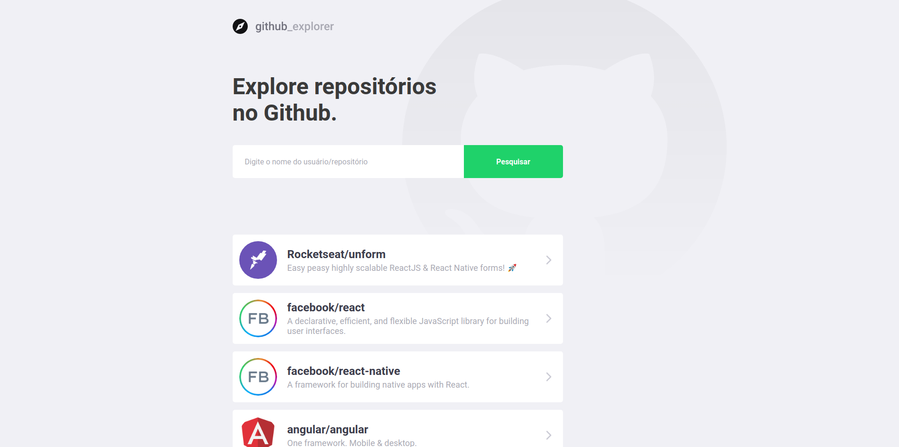

<h1 align="center">
    
</h1>

The repository of a web app that allows you to add a new github repository and display the details of each one

  

  

## 📋 Features

- **React Js** — A JavaScript library for building user interfaces
- **Styled Components** — A React library to style components
- **[Github API](https://api.github.com/)**  — A RESTful API for github repositories

## 🚀 Getting started with the app

1. Clone this repo using `git clone https://github.com/victor3r/github-explorer.git`
2. Move yourself to the appropriate directory: `cd github-explorer` 
3. Run `yarn` to install dependencies 
4. Run `yarn start` to start the web app

## 📝 License

This project is licensed under the MIT License - see the [LICENSE](https://opensource.org/licenses/MIT) page for details.
